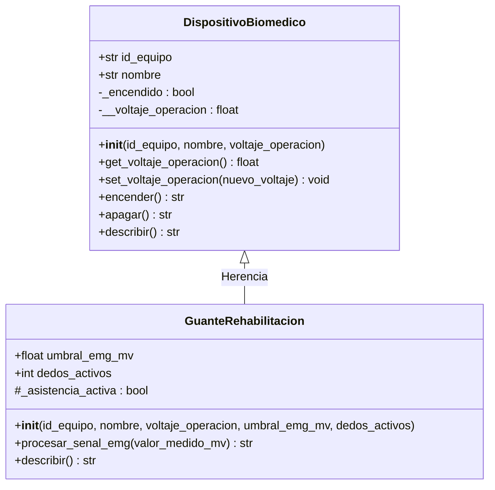

# Sistema de Dispositivos Biomédicos - Avance 2

Sistema para la gestión y control de dispositivos médicos y guante robótico para rehabilitación motora activado por EMG.

## Diagrama UML

```mermaid
classDiagram
    direction BT

    class DispositivoBiomedico {
        +str id_equipo
        +str nombre
        -_encendido : bool
        -__voltaje_operacion : float
        +__init__(id_equipo, nombre, voltaje_operacion)
        +get_voltaje_operacion() float
        +set_voltaje_operacion(nuevo_voltaje) void
        +encender() str
        +apagar() str
        +describir() str
    }

    class GuanteRehabilitacion {
        +float umbral_emg_mv
        +int dedos_activos
        #_asistencia_activa : bool
        +__init__(id_equipo, nombre, voltaje_operacion, umbral_emg_mv, dedos_activos)
        +procesar_senal_emg(valor_medido_mv) str
        +describir() str
    }

    GuanteRehabilitacion --|> DispositivoBiomedico : Herencia
```
